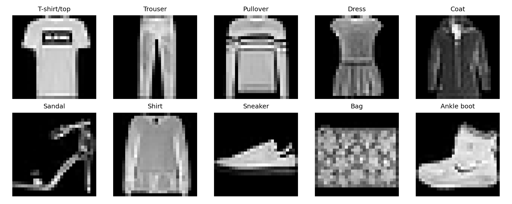
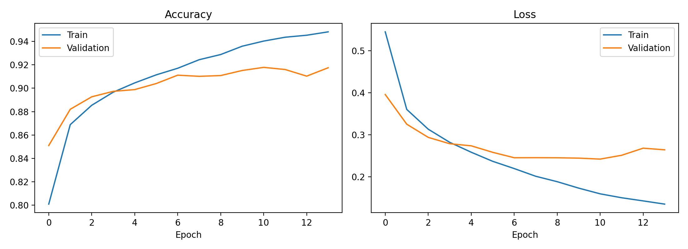
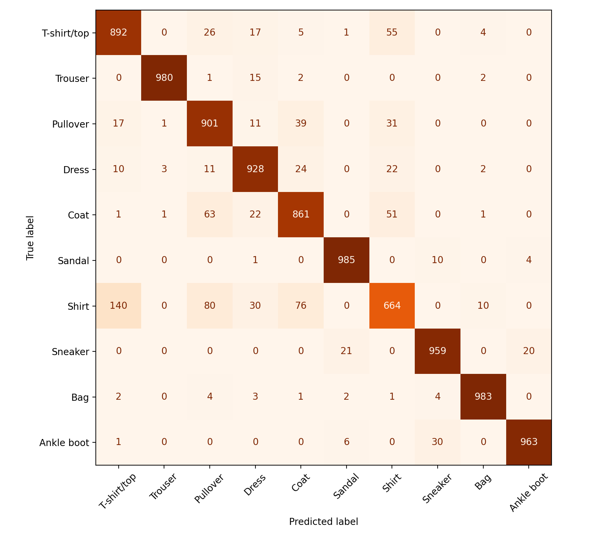
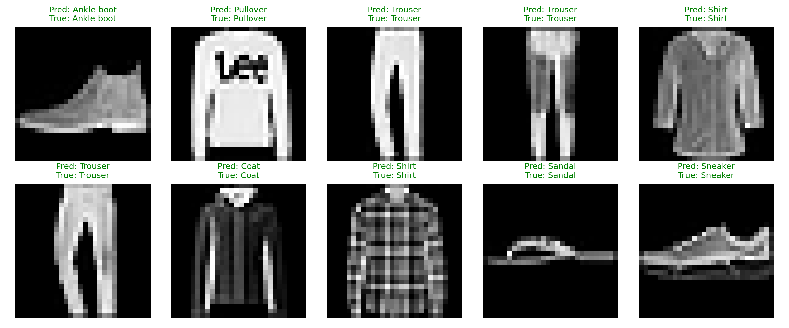

# Fashion Product Classification using Fashion-MNIST (CNN)

A Convolutional Neural Network (CNN) built with TensorFlow/Keras that classifies 28×28 grayscale clothing images into 10 categories. Deep Learning (BCA701) case study, Department of CSE (AI & ML), Sai Vidya Institute of Technology, Bangalore.

**Test accuracy: 91.16%** on the 10,000 unseen test images.

## Problem

Online fashion stores handle thousands of product images every day, and tagging them by hand is slow and inconsistent. This project builds a model that recognises the type of clothing directly from the image. The challenge is that many items look alike at low resolution (Shirt, T-shirt, Pullover, Coat).

## Dataset

- **Fashion-MNIST** by Zalando Research, loaded with `tf.keras.datasets.fashion_mnist`
- 60,000 training + 10,000 test images, each 28×28 grayscale
- 10 balanced classes: T-shirt/top, Trouser, Pullover, Dress, Coat, Sandal, Shirt, Sneaker, Bag, Ankle boot
- Preprocessing: pixels scaled to 0–1, reshaped to 28×28×1, 10% of training data held out for validation (54,000 train / 6,000 validation / 10,000 test)

## Model

Input 28×28×1 → Conv2D(32, 3×3, ReLU) → MaxPool(2×2) → Conv2D(64, 3×3, ReLU) → MaxPool(2×2) → Flatten → Dense(128, ReLU) → Dropout(0.3) → Dense(10, Softmax)

Total trainable parameters: **225,034**

| Setting | Value |
|---|---|
| Optimizer | Adam (learning rate 0.001) |
| Loss | Sparse categorical cross-entropy |
| Batch size | 64 |
| Epochs | Up to 15 with early stopping (patience 3, best weights restored) |
| Regularisation | Dropout 0.3 |

## Results

| Metric | Value |
|---|---|
| Test accuracy | 91.16% |
| Test loss | 0.2684 |
| Best validation accuracy | 91.78% |
| Final training accuracy | 94.82% |
| Macro F1-score | 0.910 |
| Epochs run | 14 (best weights from epoch 11) |

**Per-class highlights**

- Easiest: Sandal (98.5% recall), Bag (98.3%) and Trouser (98.0%)
- Hardest: **Shirt (66.4% recall)**, mostly mistaken for T-shirt/top (140 images), Pullover (80) and Coat (76), because their shapes are very similar at 28×28
- Training accuracy is about 3 points above validation. Validation loss stops improving after epoch 11 while training loss keeps falling, so early stopping restored the epoch-11 weights to limit overfitting
- All 10 of the first 10 test images were classified correctly (see prediction samples below)

## How to run

1. Open [Google Colab](https://colab.research.google.com) and create a new notebook (a T4 GPU is optional but faster).
2. Paste all of `fashion_mnist_cnn.py` into one cell and run it.
3. It downloads the dataset, trains the model, saves the plots, `results.json` and `fashion_cnn.keras`.
4. For a live demo, call `predict_test_image(25)` in a new cell.

## Repository files

| File | Purpose |
|---|---|
| `fashion_mnist_cnn.py` | Full code: load data, build, train, evaluate, plots |
| `results.json` | Saved metrics (accuracy, loss, precision, recall, F1, confusion matrix) |
| `dataset_samples.png`, `training_curves.png`, `confusion_matrix.png`, `prediction_samples.png` | Figures used above |

## Tech stack

Python, TensorFlow/Keras, NumPy, Matplotlib, scikit-learn, Google Colab

## Future improvements

- Data augmentation (small rotations and shifts)
- Deeper CNN with BatchNormalization
- Transfer learning (MobileNet/ResNet) and testing on real product photos

## Author

Akshitha R, B.E. Artificial Intelligence & Machine Learning, Sai Vidya Institute of Technology, Bangalore

## References

1. H. Xiao, K. Rasul, R. Vollgraf, "Fashion-MNIST: a Novel Image Dataset for Benchmarking Machine Learning Algorithms," arXiv:1708.07747, 2017.
2. Y. LeCun, L. Bottou, Y. Bengio, P. Haffner, "Gradient-Based Learning Applied to Document Recognition," Proc. IEEE, 1998.
3. TensorFlow/Keras tutorial: Basic classification, classify images of clothing.
